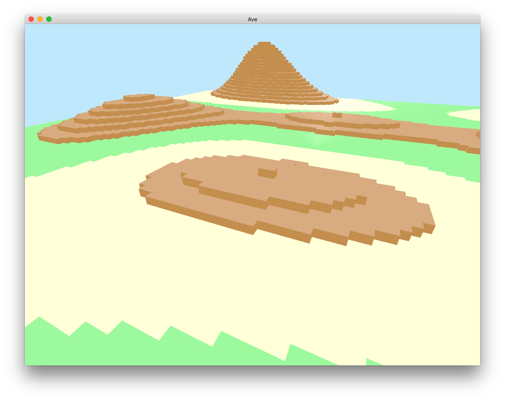

# ave - Another Voxel Engine [](https://gitlab.com/jameshiew/ave/commits/master)



Playing around with voxel-based procedural generation in Rust.

Built with lots of help from the [Glium](https://github.com/glium/glium) and [Glutin](https://github.com/tomaka/glutin) examples - most of the boilerplate code and shaders are adapted from there.

## Getting Started
Prerequisites:
* Rust
* Cargo

```
git clone https://github.com/jameshiew/ave.git
cd ave/
cargo run --release
```

### Controls
* WASD to move
* arrow keys to rotate the camera
* Q and E to speed up and slow down, respectively
* F3 to toggle a debug overlay

## Options
Choices of shader and world generator are hard coded at compile time, currently. Also, some default values such as render distance can be edited in `src/default.rs`. 
